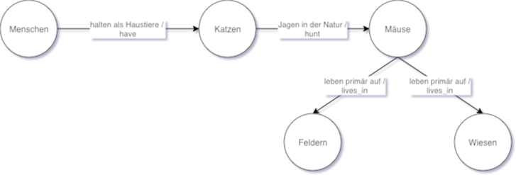

# Knowledge-based Decision Support Systems Serie 02
---

## 1

### 1.1 Modellieren Sie folgenden Sachverhalt als Semantic Network:

Katzen werden von Menschen häufig als Haustiere gehalten. In der Natur
jagen Katzen Mäuse. Mäuse leben primär auf Feldern und Wiesen.

### 1.2 Formulieren sie den gleichen Sachverhalt mit logischen Operatoren.

* **∃X : (Human(X) → HAS(X, Pet)**
* **Pet(Katze). (IS\_A)** korrekt, da IS_A der einzige Operator ist, der unär ist, also nur 1 Argument benötigt
* **∃X : (Cat(X) → IS_IN(X, Nature)**
* **∃X : (Cat(X) ⋀ IS_IN(X, Nature) → HUNTS(X, Mice)**
* **Live\_in(X, Felder) :- Mäuse(X). (LIVE\_IN)**
* **∀X : (Mäuse(X) → LIVE_IN(X,Felder))**, benötigt ∀, da im Text primär steht...
* **Live\_in(X, Wiesen) :- Mäuse(X). (LIVE\_IN)**
* **∀X : (Mäuse(X) → LIVE_IN(X,Wiesen))**

## 2. Description Logic: Formulieren Sie folgende Aussagen mittels TBox und Abox. Dazu sollen folgende Konzepte verwendet werden: Person, Glücklich, Hund, Katze.

### 2.1 Eine Person ist glücklich

∃Person ≡ Glücklich  
TBox: Person ≡ Glücklich  
ABox: -

### 2.2 Eine Person die ein Hund besitzt ist glücklich

Person ⊓ hasPet.Hund ≡  Glücklich  
TBox: Person ≡ Glücklich ⊓ ∃hasPet.Hund  
ABox: -

### 2.3 Reto besitzt einen Hund und ist glücklich

(Person ⊓ hasPet.Hund ⊓  Glücklich)(Reto)  
Falls die oben beschriebene TBox beachtet wird reicht der folgende Ausdruck:
(Person ⊓ hasPet.Hund )(Reto)  
TBox: Person ≡ Glücklich ⊓ ∃hasPet.Hund  
ABox = Person(Reto)

### 2.4 Tanja besitzt eine Katze mag aber keine Hunde

(Person ⊓ hasPet.Katze ⊓ ¬ likesPet.Hund)(Tanja)  
Tbox = Person ≡ ∃besitzt.Katze ⊓ ¬mag.Hund  
Abox = Person(Tanja)

### 2.5 Welches Resultat ergibt folgende Aussage (K=(T,A))

Hunde haben einen Halter.  
Wobei der Kontext Hund = Fido und Halter = Alex  
Dies heisst dass Alex der Halter von Fido ist  
K =(T, A) then K ⊢ HalterVon(Alex, Fido)

