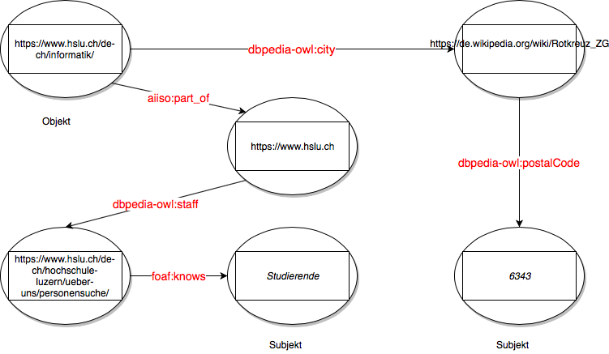
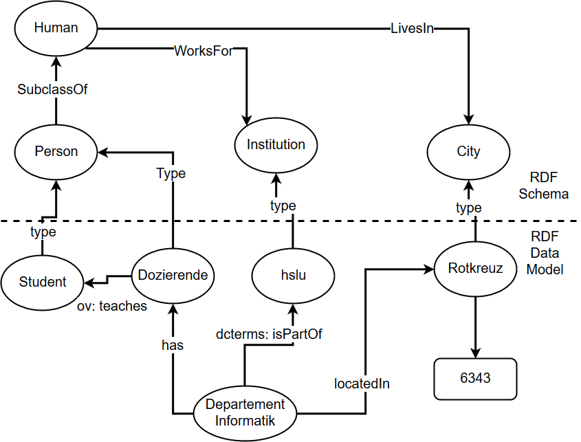

# Knowledge-based Decision Support Systems Serie 03
---

## 1. Folgender Sachverhalt soll zunächst mit RDF modelliert werden:

1. Das Departement Informatik der Hochschule Luzern befindet sich in
Rotkreuz.
2. Die Postleitzahl von Rotkreuz lautet 6343.
3. An der Hochschule Luzern arbeiten Dozierende.
4. Dozierende unterrichten Studierende.

## 2.Modellieren sie den gleichen Sachverhalt nun mit RDFS, dabei sollen die hierarchischen Abhängigkeiten berücksichtigt werden.

 

## 3. Überlegen sie sich einen Anwendungsfall für Knowledge Graphs in ihrem Umfeld. Beschreiben sie zunächst den Anwendungsfall und danach die daraus resultierenden Vorteile durch den Einsatz eines Knowledge Graphs. 
Anwendungsfall Studiumsplanung

Als Student ist man in jedem Semester aufs neue verunsichert, welche Module man wählen soll. Die Majors weisen einem zwar grob den Weg aber oftmals wird man durch Feedback von anderen Studenten oder durch andere interessante Modulnamen von diesem Weg abgebracht. 

Ein Knowledgegraph würde hier diverse Vorteile bringen. Würde man in den Knowledgegraph die Unterrichtsthemen und die Art der Behandlung dieser Themen einfliessen lassen, so könnte man anhand der bisher gewählten Module schauen, welche Module ähnliche oder weiterführende Inhalte behandeln würden. Zudem könnte man Zusammenhänge zwischen Modulen erkennen und anhand dieser und anhand der Art der Behandlung des Stoffs Entscheidungen treffen, wie es im Studium weitergehen soll.

Auch für die Schule könnte ein solcher Knowledgegraph über die Modulinhalte und deren Vermittlung interessant sein. Zum einen würde man dadurch sehr schnell Überschneidungen und Abhängigkeiten von Modulen erkennen. Diese könnten dann den Studenten weitergegeben werden. Zum anderen würden die Behandlungsarten in Zusammenhang mit den Studentenzahlen und deren Noten zeigen, wie effizient eine bestimmte Art von Vermittlung des Stoffes ist.